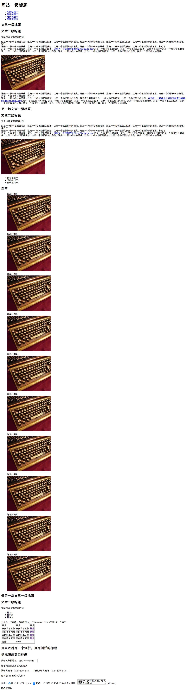

## 任务一：零基础HTML编码普通
导师小薇小薇学院
人数有4514人在学习该课程，有1295人已经完成该课程

时间平均用时1.7天
关键词HTML

#### 课程概述

作业提交截止时间：04-24

### 重要说明
百度前端技术学院的课程任务是由百度前端工程师专为对前端不同掌握程度的同学设计。我们尽力保证课程内容的质量以及学习难度的合理性，但即使如此，真正决定课程效果的，还是你的每一次思考和实践。

课程多数题目的解决方案都不是唯一的，这和我们在实际工作中的情况也是一致的。因此，我们的要求不仅仅是实现设计稿的效果，更是要多去思考不同的解决方案，评估不同方案的优劣，然后使用在该场景下最优雅的方式去实现。那些最终没有被我们采纳的方案，同样也可以帮助我们学到很多知识。所以，我们列出的参考资料未必是实现需求所必须的。有的时候，实现题目的要求很简单，甚至参考资料里就有，但是背后的思考和亲手去实践却是任务最关键的一部分。在学习这些资料时，要多思考，多提问，多质疑。相信通过和小伙伴们的交流，能让你的学习事半功倍。

### 任务目的
了解HTML的定义、概念、发展简史
掌握常用HTML标签的含义、用法
能够基于设计稿来合理规划HTML文档结构
理解语义化，合理地使用HTML标签来构建页面

### 任务描述
参考示例图（），完成一个HTML页面代码编写（不写CSS，不需要关注样式，只关注文档结构）

### 任务注意事项
只需要完成HTML代码编写，不需要写CSS
示例图仅为参考，不需要完全实现一致，其中的图片、文案均可自行设定
尽可能多地尝试更多的HTML标签

### 在线学习参考资料
1. [Web相关名词通俗解释](https://www.zhihu.com/question/22689579)
2. [MDN HTML入门](https://developer.mozilla.org/zh-CN/docs/Web/Guide/HTML/Introduction)
3. [慕课HTML+CSS基础教程视频](http://www.imooc.com/learn/9)
